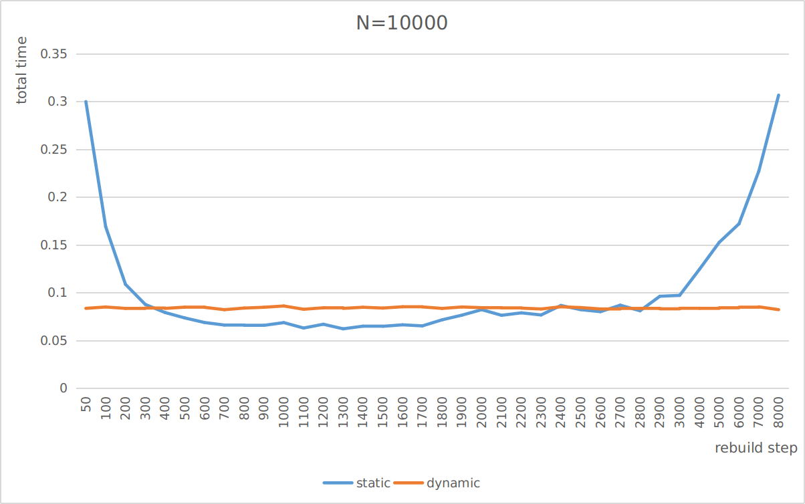
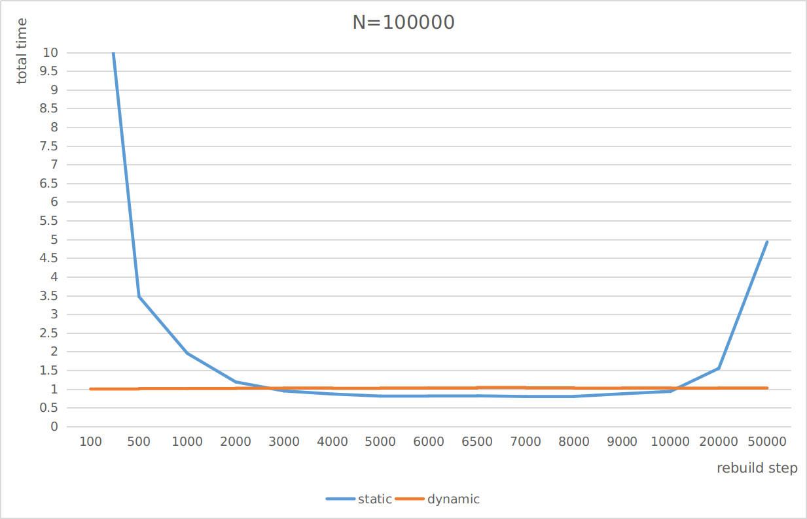
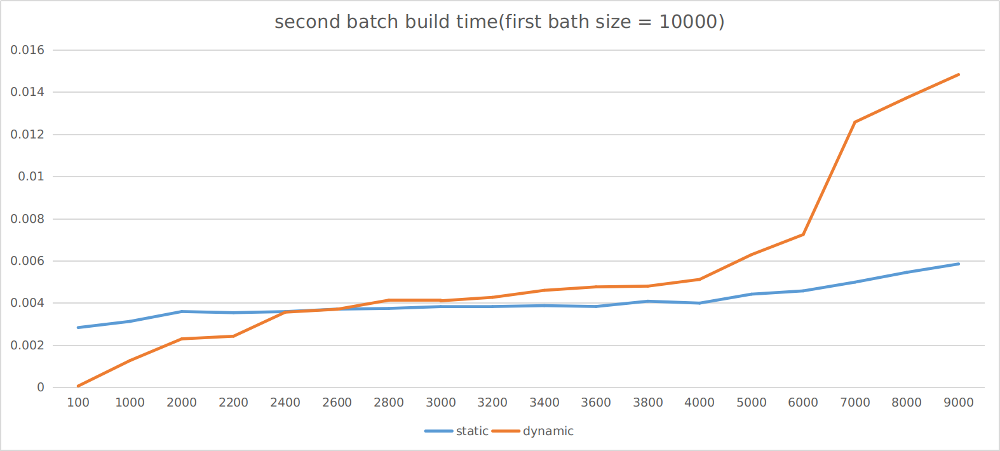
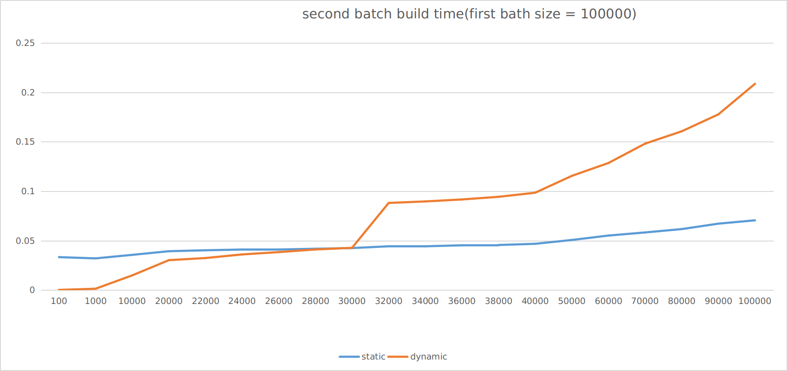
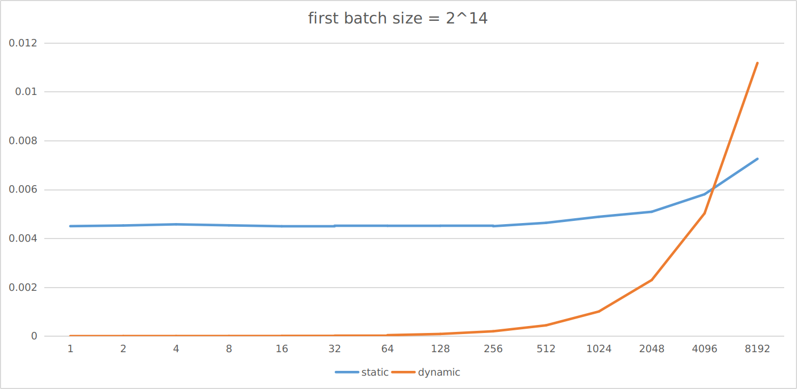
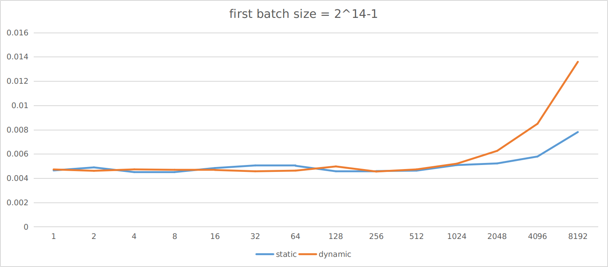
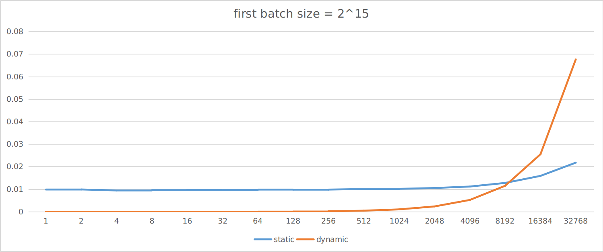
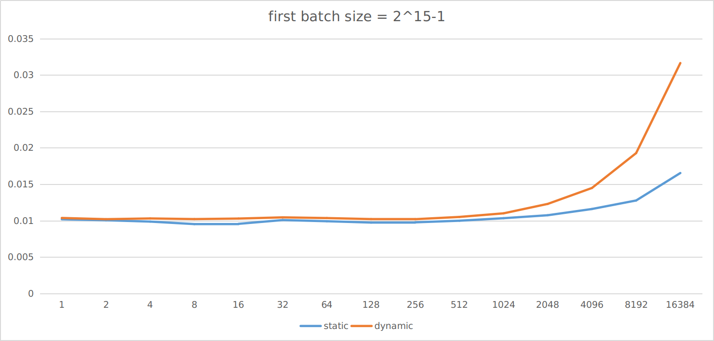

### testfun4()

该测试函数的目的是测试在节点数量（N）固定，每次操作为**一次查询接一次插入**（模拟RRT的拓展步骤）的情况下，Dynamic Kd Tree和采用**不同rebuild策略**的Static Kd Tree 的总时长。

**N=10000**

**N=100000**

### testfun5()

该测试函数的目的是测试在树中已经有N1个节点(first batch size)，再往树中插入N2个节点的情况下，Static Kd Tree和Dynamic Kd Tree 消耗时间的对比。

**N=10000**

**N=100000**

当不考虑N是不是在2^n的附近时，存在一个临界值value，当再次插入的节点数小于value的时候，Dynamic Kd Tree的建树效率更高。

**N=2^14**

**2^14-1**

**2^15**

**2^15-1**

当N==2^n的时候，因为这里Dynamic Kd Tree采用的是**logarithmic method**，所以此时Dynamic Kd Tree刚好完成所有小子树的合并，生成了一颗size=2^n的树，之后的2^n-1次插入都不会影响到这个树，可以看到**临界值出现在2^(n-1)～2^n之间的某处** 

而当N==2^(n)-1的时候，下一次插入就会导致前n颗子树销毁，重建一颗size=2^n的大树，这一步的开销是略大于建一个size=2^n的Static Kd Tree的。所以这种情况是没有啥临界值的。