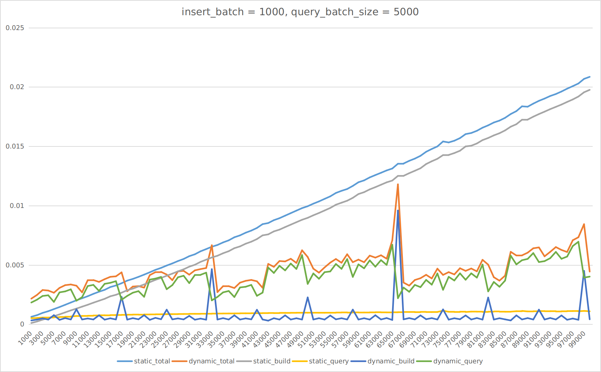
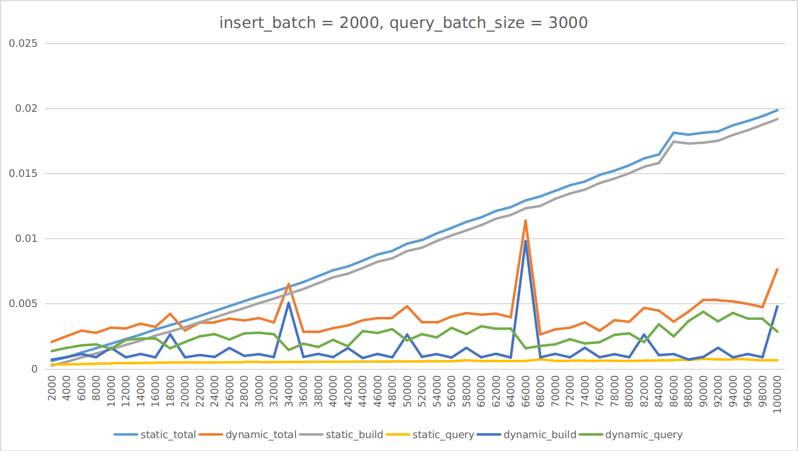
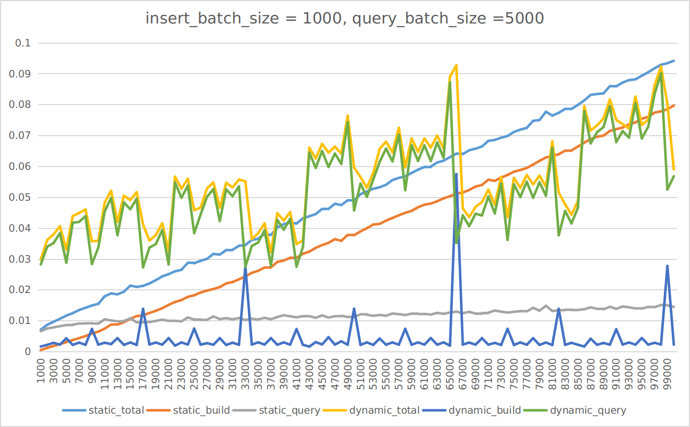
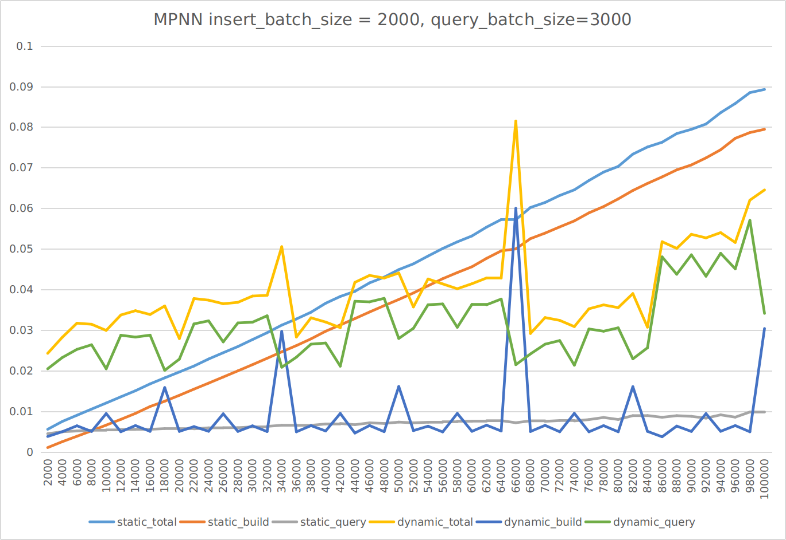
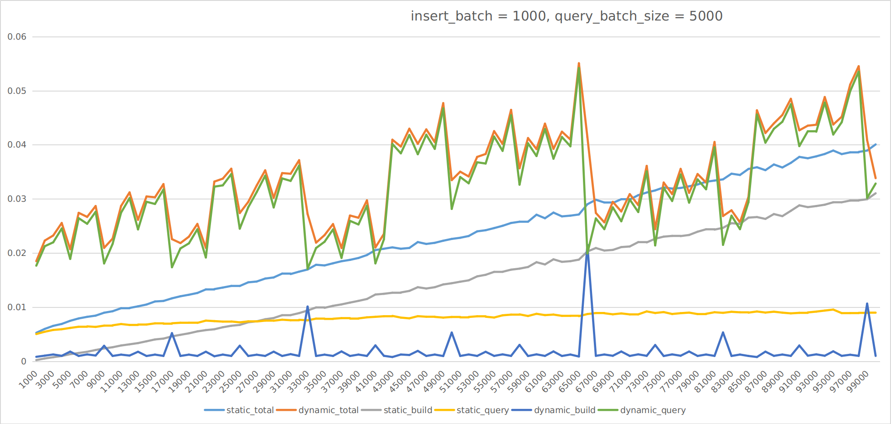
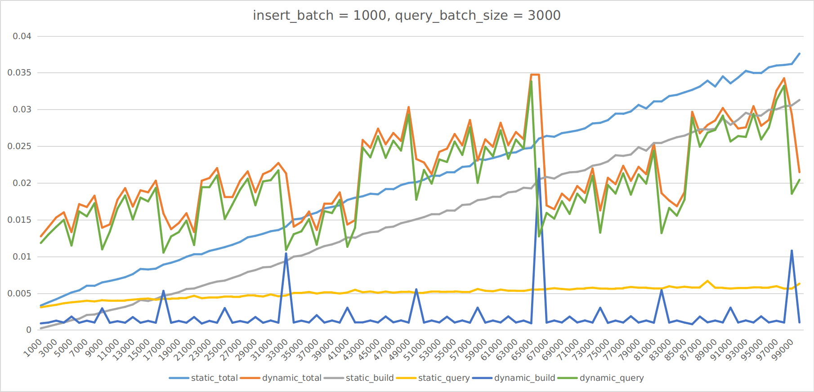
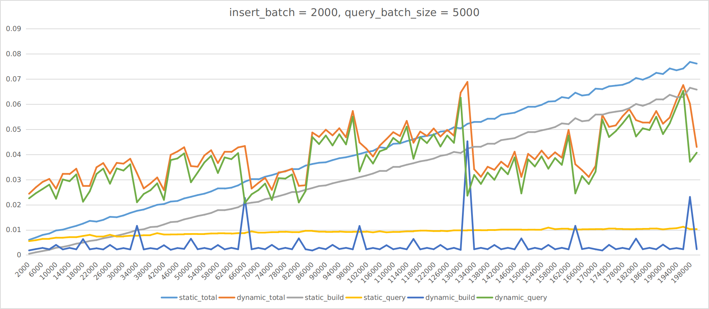
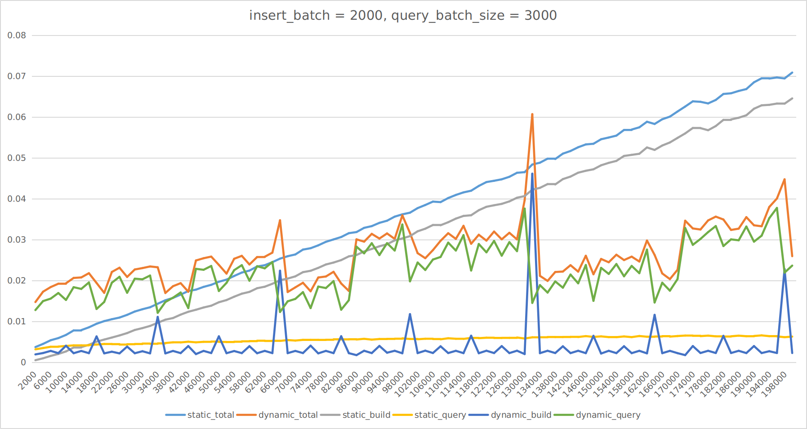

# Dynamic KDTree

Dynamic KDTree is a dynamic version of the Kd tree that supports dynamically inserting nodes while keeping the tree balanced. The approach used in this project is a standard method to perform the static-to-dynamic transformation of a data structure, called *the **logarithmic method***.


### Experiment

### 4.7

测试了**nanoflann**在**testfun6**场景下的性能表现，临界值大大提前，在17000处，之前我的实现和mpnn的实现是68000附近，在其他参数的测试下提升也很明显。

我对比了相同测试场景下各种时间的相对值，就Static Kd Tree而言，nanoflann的build time是我的2~3倍，但是query_time是8～9倍，query_time的性能提升相比于build_time明显的多，弱化了两者在query上的差距，放大了两者在build上的差距，所以临界值提前了。






### 3.31

nanoflann里有dynamic kd tree...

### 3.30 

首先测试了**Lazy rebuid**，查询效率比**logarithmic method**还差，大数据量的插入还有内存泄漏的问题，damn!

然后测试了一份目前唯一能找到的关于Dynamic Kd Tree论文中提到的开源代码**MPNN**，作者是*Anna Yershova
Steven M. LaValle*，他们采用的动态算法也是**logarithmic method**，不过他们的静态结构是**ANN**。目前根据代码支持的功能测试了**testfun6()**.

在**insert_batch_size=1000, query_batch_size=5000**测试结果和我的几乎一致，约为65536




在**insert_batch_size=2000, query_batch_size=3000**，临界点是我的一半，约为32768。




### testfun4()

该测试函数的目的是测试在节点数量（N）固定，每次操作为**一次查询接一次插入**（模拟RRT的拓展步骤）的情况下，Dynamic Kd Tree和采用**不同rebuild策略**的Static Kd Tree 的总时长。

**N=10000**


**N=100000**


### testfun5()

该测试函数的目的是测试在树中已经有N1个节点(first batch size)，再往树中插入N2个节点的情况下，Static Kd Tree和Dynamic Kd Tree 消耗时间的对比。

**N=10000**


**N=100000**


当不考虑N是不是在2^n的附近时，存在一个临界值value，当再次插入的节点数小于value的时候，Dynamic Kd Tree的建树效率更高。


**N=2^14**


**2^14-1**


**2^15**


**2^15-1**


当N==2^n的时候，因为这里Dynamic Kd Tree采用的是**logarithmic method**，所以此时Dynamic Kd Tree刚好完成所有小子树的合并，生成了一颗size=2^n的树，之后的2^n-1次插入都不会影响到这个树，可以看到**临界值出现在2^(n-1)～2^n之间的某处** 

而当N==2^(n)-1的时候，下一次插入就会导致前n颗子树销毁，重建一颗size=2^n的大树，这一步的开销是略大于建一个size=2^n的Static Kd Tree的。所以这种情况是没有啥临界值的。

上述问题是**logarithmic rebuild**法的一个问题，它的最坏时间复杂度很糟糕，另一种方法**lazy rebuild**可以在不增加平均时间复杂度的情况下将最坏时间复杂度降到平均时间复杂度。


之前testfun4的测试结果表明，采用了合理的rebuild策略的Static Kd Tree在**一次插入接一次查询**的应用情景下性能已经优于Dynamic Kd Tree了，主要的原因是由于rebuild带来的额外开销对总时常影响不大。


### testfun6()

每次来1000或2000个新节点，然后做3000或5000次查询，static kd tree是每次来一批新节点后重建树：

**insert_batch=1000, query_batch_size=5000**





**insert_batch=1000, query_batch_size=3000**





**insert_batch=2000, query_batch_size=5000**





**insert_batch=2000, query_batch_size=3000**




### Interface

**Build tree**

``` c++
// static version
//you can an empty Kd tree then insert nodes into it.
//In this case, I allocate enough space for the data buffer.
SKDTree<float, 3> static_kdtree;

// or you can feed data into it and build a balanced tree. 
//In this case, I simply assign the input pointer to the inner pointer pointing to the data buffer, so you are not allowed to insert the new node into it because the capacity is limited.(maybe need to update) 
float datas[6] = {1, 1, 1,
                  2, 2, 2};
SKDTree<float, 3> static_kdtree(datas, 2, false);

// dynamic verision, just the same as static version
DKDTree<float, 3> dynamic_kdtree;

float datas[6] = {1, 1, 1,
                  2, 2, 2};
DKDTree<float, 3> dynamic_kdtree(datas, 2);

```


**Insert node**

``` c++
// e.g.
vector<float> p;
for (int j = 0; j < dimension; j++) {
    p.push_back(j);
}
static_kdtree.insertNode(p);
dynamic_kdtree.insertNode(p);
```


**Nearset-neighbor Search**

```  c++
vector<float> p;
vector<float> static_nn_result, dynamic_nn_result;
for (int j = 0; j < dimension; j++) {
    p.push_back(j);
}

static_nn_result = static_kdtree.NNSearch(p);
dynamic_nn_result = dynamic_kdtree.NNSearch(p);
```


**Visualize tree**

``` c++
static_kdtree.printTree();
dynamic_kdtree.printTree();
```


### TODO List

1. Add some useful tricks into Static Kd Tree to make it closer to actual applications, such as rebuilding strategy. Then try to simulate the sampling and extending process of RRT，and compare the performance of these two versions.
2. Embed Dynamic Kd Tree in other RRT implementations to figure out whether dynamic version can ve used in actual applications.