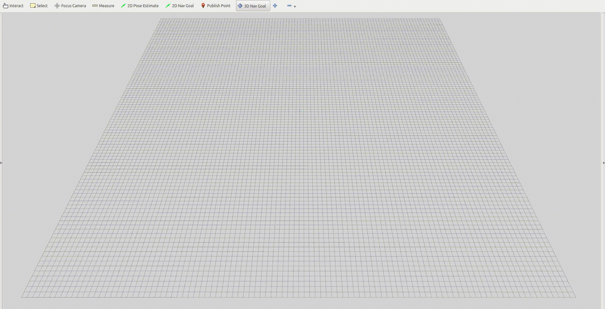

# Naive Polynomial Trajectory Generator

## Consider only higher derivative constraints like velocity, acceleration and jerk.

## Building
```
cd ${YOUR_WORKSPACE_PATH}/src
git clone https://github.com/kyleYehh/naive_poly_traj_gen
cd ..
catkin_make
```

## Run
Open a terminal
```
roslaunch state_machine rviz.launch
```
Open another terminal
```
roslaunch state_machine planning.launch
```
In Rviz panel, add a plugin named Goal3DTool, and then press key "g" in the keyboard, and then click both the left and right buttons in the mouse meanwhile move it to change the goal height.

<p align="center">
  
</p>

The red curve is the initial trajectory that may violate the constraints, and the blue curve is the optimized trajectory.

## Parameters
In planning.launch
